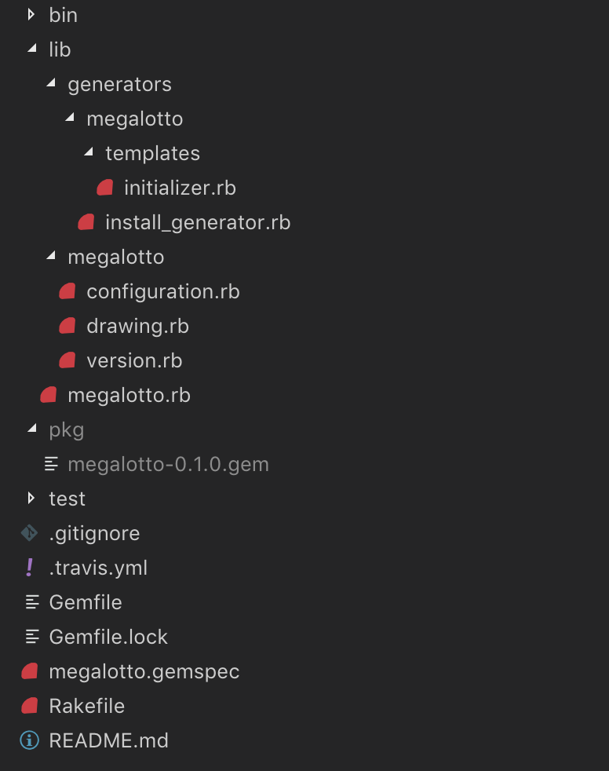

# Megalotto

A sample Gem from https://brandonhilkert.com/blog/ruby-gem-configuration-patterns/

Written to test out adding a configuration file to a Gem.

## Installation

Add this line to your application's Gemfile:

```ruby
gem 'megalotto'
```

And then execute:

    $ bundle

Or install it yourself as:

    $ gem install megalotto

Run generator to create initializer (in config/initializers/megalotto.rb):

    $ rails g megalotto:install

## Useful links

- https://bundler.io/v1.17/guides/creating_gem.html

- https://brandonhilkert.com/blog/ruby-gem-configuration-patterns/
- https://github.com/carrierwaveuploader/carrierwave#configuring-carrierwave
- https://robots.thoughtbot.com/mygem-configure-block
- https://github.com/thoughtbot/clearance


---


## Creating a generator

- Folder structure:  

  

- Example generator

```ruby
require 'rails/generators'
require 'rails/generators/base'

module Megalotto
    module Generators
        class InstallGenerator < Rails::Generators::Base
            puts 'install generator class accessed'
            # source_root File.expand_path('templates', __dir__)
            # desc 'This generator creates an initializer file at config/initializers/megalotto.rb'

            def create_initializer_file
                puts 'install generator create_initializer_file method accessed'
                # template 'initializer.rb', 'config/initializers/megalotto.rb'
            end
        end
    end
end
```

- Example Template

```ruby
Megalotto.configure do |config|
    # Set drawing count configuration value
    config.drawing_count = 10
end
```

### Build the Gem

- No need to require the generators in the megalotto.rb. Rails should be able to find the generator from the built gem `./pkg/megalotto-0.1.0.gem`.

- Add to git `git add .` or the file will not be picked up by spec.files in the megalotto.gemspec

- `rake build` to create the built gem in `./pkg/megalotto-0.1.0.gem`

### Install the Gem

- Navigate to the project that will use the gem

- `gem install ../local_gems/megalotto/pkg/megalotto-0.1.0.gem`

- Open the project Gemfile and add `gem 'megalotto'` to the dependencies

- `bundle install`

### Run the generator

- `rails g` you should see the generator listed
```
Megalotto
megalotto:install
```
> Note you may need to run `spring stop` and try again if the generator is not listed. Otherwise check the directory structure in the gem.

- `rails g megalotto:install` to run the installer